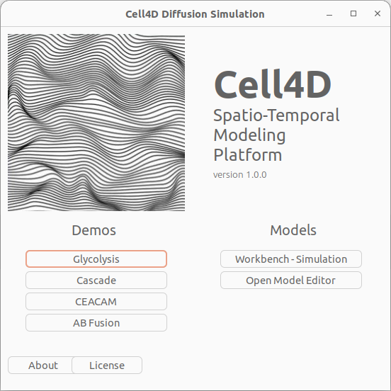
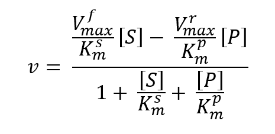

# Cell4D
---

Cell4D is a Linux-and-MacOS C++\-based graphical spatial stochatic cell simulator capable of simulating a wide variety of cellular pathways. Molecules are simulated as particles within a user-defined simulation space under a Smoluchowski-based reaction-diffusion system on a static time-step basis. At each timestep, particles will diffuse under Brownian-like motion and any potential reactions between molecules will be resolved. Simulation space is divided into cubic sub-partitions called c-voxels, groups of these c-voxels can be used to define spatial compartments that can have optional rules that govern particle permeability, and reactions can be compartment-specific as well.

The program can be run in a graphical mode where the user can view the simulation state as it is being modelled, or a non-graphical mode if only the model data output is desired. Data output includes a count table for all molecules in each compartment in a .tsv format, JSON particle position logs that record the position and state of all particles at regular time-step intervals, as well as intermediate JSON checkpoint files that can be used to resume simulations without needing to start over from the beginning.

## Installation
---

This program can be run on MacOS or Linux systems only. To install, navigate to the directory containing the Cell4D files and type:

```bash
./build_and_run.sh
```

This script will download all required dependencies of Cell4D and compile the source files into an executable named "simulation".


## Usage
---


#### Graphical mode

## Menu Options
---
- Glycolysis: launches a glycolysis reaction simulation demo
- Cascase: launches a cascase reaction simulation demo
- CEACAM: launches a CEACAM reaction simulation demo
- AB Fusion: launches an AB Fusion reaction simulation demo

- Workbench - Simulation: Prompts the user to supply a SBML-compliant model file in XML
- Open Model Editor: Launches a FireFox web browser instance to the Online Model Editor at https://compsysbio.org/cell4d_ui/build

- About: Displays information on where to get additional help
- License: Displays information on where to locate the license for this tool
Graphical mode can be started by running the program without --no-graphics option.
```bash
./simulation <file-name> <additional-options>
```

Alternatively, running the program without specifying a file will open a prompt with options to select a model file you wish to run, or open example demo files. 
```bash
./simulation
```

Using either option to open the selected model file will cause the simulation UI to appear.


The camera angle on the graphical simulation space can be freely rotated and zoomed, but not translated. Camera will always be centered on the simulation space. 
On the sidebar on the right are the runtime options of Cell4D graphical mode. 

Simulations can be freely started/paused/resumed by using the Run Simulation checkbox, the ranged input bar controls the simulation speed. 
Particles and bulk molecules can be selectively hidden by the Display Proteins and Display Concentrations checkboxes respectively. 


Compartments can be highlighted by Display Environment. 


If bulk molecules exist within the simulation, they can be selectively shown with the radio boxes under Show All Metabolites.


#### Non-graphical mode
To run in non-graphical mode, navigate to the Cell4D folder and type

```bash
./simulation <file-name> --no-graphics <additional-options>
```

where <file-name> is the path to the Cell4D XML model file. A comprehensive list of run options can be found with:

```bash
./simulation --help
```

In this mode, no graphics will be loaded and the simulation will simply start with events such as reactions being logged in the console output. Once the simulation is completed, the model data output will be automatically generated.

## Input files
---

Model files are written in XML, using a modified form of level 2 SBML. There are 6 main sections of a Cell4D model file: Environmental Variables, List of Compartments, List of Annotation Species, List of Species, List of Reactions, List of Events.

#### Environmental Variables

Environmental variables specify general simulation parameters such as the XYZ-dimensions of the simulation space (c-voxels in each cartesian direction), time and space-scale of the simulation, shape of the space, and total number of timesteps to simulate.

#### List of Compartments

The list of compartments describes all spatial compartments within the model as well as their locations. This is done by using 6 coordinates: x1 y1 z1, x2 y2 z2, to define rectangular prisms of arbitrary size within the bounds of the simulation space. Any number of these coordinate groups can be used in the definition of a compartment, meaning any arbirary shape for a compartment can be defined using these parameters.

#### List of Annotation Species

The list of annotation (or base) species describes the attributes of each unit that serves as a building block for a molecular species. For example, in a simple dimer reaction system where molecules ```A + B -> AB```, molecules ```A``` and ```B``` are comprised of a single unit of species ```A``` and ```B``` respectively. ```AB``` is a molecule that is formed by one unit of ```A``` and one unit of ```B```. This section describes the properties of these units, including their species type (discrete particle vs bulk molecule), diffusion constant, displayed color, a list of valid spatial compartments, and optional modification sites and binding sites.

There are two ways to model molecules in Cell4D: they can be simulated as discrete dimensionless point particles, or as local concentrations of molecules within a c-voxel. The particle approach should be used for most cases, as it is the most fine-grain method to simulate molecules and their interactions with one another. However, for molecules that are particularly high in concentration, such as ions, it would be more efficient to simulate them as local concentrations using the "bulk molecule" approach, which reduces the number of computations required to simulate the diffusion and reactions of that molecule type.

Species binding sites are additional optional parameters for the species definition. each site consists of a binding site name and optional binding state parameters

> Binding site name: string  

> Site states: Array\<string> | null

Sites with no site states will be considered "binding sites" with two possible states: ```bound``` and ```unbound```. These are flags indicating if a site is in use for molecule complexes with multiple species bound together.  
Site states can also be filled with multiple ```states```, which indicate the modification state of the species. For example, a species that can be phosphorylated can have the ```P``` and ```U``` site states, representing the phosphorylated and unphosphorylated states respectively. Binding sites can have as many sites as the user would like, but it is recommended that modification sites have at least 2 states.  

#### List of Species

Molecular species are comprised of one or more building block units of base species, described above. Using the previous example, species ```AB``` is a molecule that is formed by one unit of ```A``` and one unit of ```B```. This section lists a number of combinations of base species as well as their modification states and defines the molecule as a "species." By default, molecule properties are automatically inherited from the species that make up the molecule. 

#### List of Reactions

Reactions are patterns (reaction rules) that describe how molecules interact with one another within the simulation. 

> Reaction name: string  

> Reaction compartment: Array\<string> | null  

The reaction compartment fields allow the user to optionally select certain compartments where the reaction can occur in. If left blank, the reaction can occur anywhere within the simulation space.

Reactions are divided into interaction reactions and enzymatic reactions. Enzymatic reactions involve the conversion of a bulk molecule reactant into a bulk molecule product by a "modifier" enzyme, which is not changed by the reaction. The reaction kinetics are defined by the four reversible Michaelis-Menten parameters in the following equation:




> Vfmax: number  
> Vrmax: number  
> Ksm: number  
> Kpm: number  

Interactions are the other type of reactions, and include unimolecular reactions and bimolecular reactions, which have one and two reactants respectively, and can produce one or more products. Interaction reactions can be set to reversible, which will require an additional reaction rate input.

> Reaction rate constant  
> Reverse reaction rate constant  

The units of the reaction rate constant depends on the number of reactants. For unimolecular reactions, the units of the rate constant are s<sup>-1</sup>. For bimolecular reactions it will be s<sup>-1</sup>M<sup>-1</sup>.

> List of reactants: molecule: base species  
> List of products: molecule: base species  

For interaction reactions, reactants are limited to a maximum of two molecules, but there is no limit on the number of product molecules. Each of these molecules must have at least 1 base species, but the binding and modification sites of the species are optional. When determining if a molecule is a valid reactant, the parameters listed in the list of reactants are compared to the molecule, so unspecified reactant sites will not be checked and are valid by default, regardless of its state. For product molecules, unfilled site parameters will be unchanged after the reaction.  

For enzymatic reactions, there may only be one reactant and one product, and they must both be bulk molecules. The modifier must be a particle.

#### List of Events

Events are custom behaviors that can be added to the simulation model that are unrelated to events. They can be set to happen from various triggers, and also set to execute probabilistically after the trigger occurs.

> Event name: string  

> Event probability: number  

> Event type: "Add molecules" | "Remove molecules" | "Molecule transport"  

Currently there are three types of possible events. A molecule, configured in the [List of Molecules](#List-of-Molecules), can be added to or deleted from a certain location, or be transported from one location to a different destination.

> Event location: string | X,Y,Z | X1,Y1,Z1, X2,Y2,Z2

Locations in an event definition can be formulated as a compartment string, a 3D coordinate representing a voxel, or two coordinates that form opposite corners of a rectangular prism, similar to a compartment lattice definition.

> Event trigger: "Time triggered" | "State triggered" | "Event triggered"  

There are three possible triggers for an event

> Time triggered: 
>> Repeat interval: integer | null  
>> Initial timestep: integer  
>> Final timestep: integer | null  

Time triggered events require an initial timestep that indicates the first time the event will occur, and can optionally be repeated after an interval of timesteps. The event can trigger repeatedly until the end of the simulation, or a final timestep can be specified which terminates further event activation after the selecte timestep.

> State triggered: 
>> Repeat interval: integer | null  
>> Initial timestep: integer  
>> Final timestep: integer | null  
>> Trigger location: string | X,Y,Z | X1,Y1,Z1, X2,Y2,Z2  
>> Trigger condition:  
>>> Molecule: string  
>>> Type: "more than" | "less than"  
>>> amount: integer  

State triggered reactions will have a trigger condition where the event will activate if a selected molecule, defined in the [List of Molecules](#List-of-Molecules), is greater or lesser than a specified amount within the trigger location when the state trigger condition is checked. The interval at which this condition is checked is specified by the repeat interval, so a repeat interval of 1 will cause the simulation to check for this trigger condition at every timestep.

> Event triggered: 
>> Triggering event: string  
>> Triggering delay: integer  

Finally, events can be triggered by other events. The event-triggered event can occur immediately after the triggering event occurs, or can be set to fire after a timestep delay.

## Authors
---

Donny Chan, Graham Cromar, Billy Taj & John Parkinson
